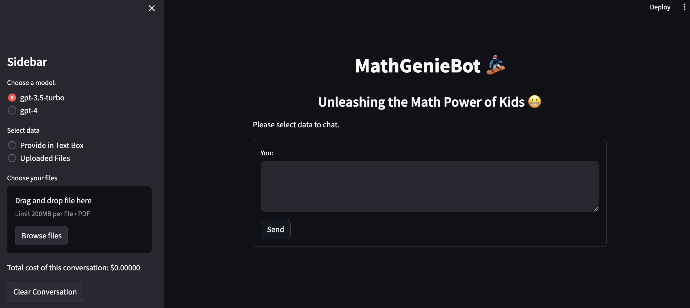
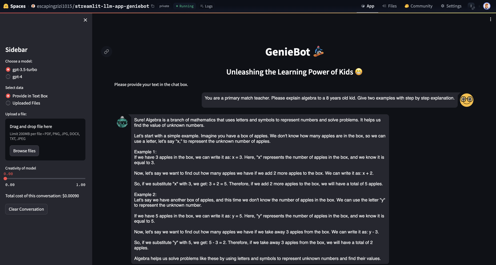
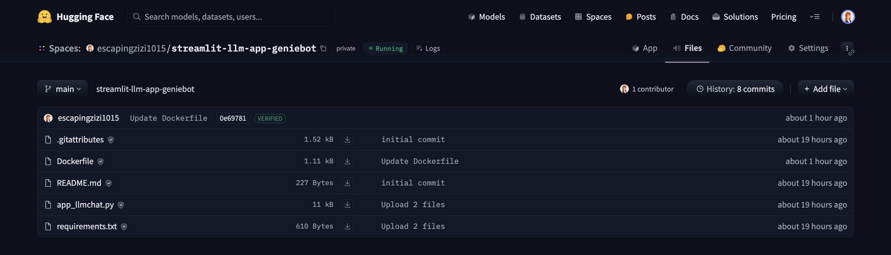

# Streamlit-LLMApp


GenieBot - Unleashing the Learning Power of Kids 😬. 

A LLM Chat application built using streamlit with features to select LLM models, calculating total cost, chat in box, chat over uploaded data.

### Components
- A Chatbot using LangChain, Streamlit and LLMs like OpenAI GPTs
- It can be run locally or using Docker
- It can be deployed to Huggingface space via Docker Space SDK

## Pre-requisites
- OpenAI API Key
- Docker (if using this option)
- Huggingface account (if deploy to Huggingface Space)


## Running Locally
1. Clone the repository
```bash
git clone https://github.com/LIFENGZI1015/streamlit-llmapp.git
```
2. Install dependencis
```bash
pip install -r requirements.txt
pip install "unstructured[all-docs]"
```
3. Install Tesseract
- https://tesseract-ocr.github.io/tessdoc/Installation.html
- For example macOS:
```bash
brew install tesseract
```
4. Run the application with this command
```bash
streamlit run app_llmchat.py
```
5. Ctrl+C to stop the app


## Running app locally using Docker
1. Run the docker container using docker-compose (Recommended)
```bash
docker-compose --env-file .env up --build
```
2. Stop docker-compose
```bash
docker compose stop
```
3. Ctrl+C to stop everything


## Deploy to Huggingface Space via Docker SDK


1. Create Space in your Huggingface account
- https://huggingface.co/docs/hub/spaces-overview

2. Add OPENAI_API_KEY as secret in the Space Settings
- https://huggingface.co/docs/hub/spaces-overview#managing-secrets

3. Upload or create following files to Huggingface Space


Please note that Dockerfile_hf in this repo is used to deploy streamlit llm app on Huggingface. Change name when you upload it to Huggingface.


### References
1. Build LLM App with Docker and Streamlit
- https://www.packtpub.com/article-hub/building-a-containerized-llm-chatbot-application
- https://docs.streamlit.io/knowledge-base/tutorials/deploy/docker
- https://www.docker.com/blog/build-and-deploy-a-langchain-powered-chat-app-with-docker-and-streamlit/
2. Deploy Docker App in Huggingface Space
- https://huggingface.co/docs/hub/spaces-sdks-docker-first-demo
- https://www.docker.com/blog/build-machine-learning-apps-with-hugging-faces-docker-spaces/
- https://huggingface.co/blog/HemanthSai7/deploy-applications-on-huggingface-spaces
- https://huggingface.co/docs/hub/spaces-sdks-docker#secret-management