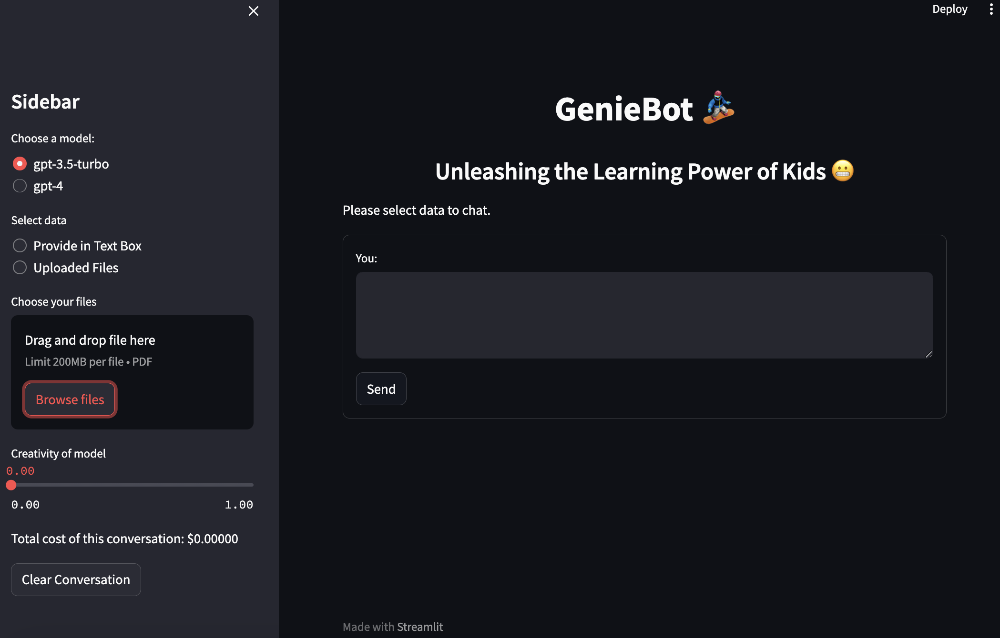

# Streamlit-LLMApp



GenieBot - Unleashing the Learning Power of Kids 😬. 

A LLM Chat application built using streamlit with features to select LLM models, calculating total cost, chat in box, chat over uploaded data.

### Components

- A Chatbot using LangChain, Streamlit and LLMs like OpenAI GPTs
- It can be run locally or using Docker

## Pre-requisites
- OpenAI API Token
- Docker (if using this option)

## Running Locally

1. Clone the repository
```bash
git clone https://github.com/LIFENGZI1015/streamlit-llmapp.git
```
2. Install dependencis
```bash
pip install -r requirements.txt
pip install "unstructured[all-docs]"
```
3. Install Tesseract
- https://tesseract-ocr.github.io/tessdoc/Installation.html
- For example macOS:
```bash
brew install tesseract
```
4. Run the application with this command
```bash
streamlit run app_llmchat.py
```
5. Ctrl+C to stop the app

## Running app using Docker
1. Run the docker container using docker-compose (Recommended)
```bash
docker-compose --env-file .env up --build
```
2. Stop docker-compose
```bash
docker compose stop
```
3. Ctrl+C to stop everything

### References
- https://www.packtpub.com/article-hub/building-a-containerized-llm-chatbot-application
- https://docs.streamlit.io/knowledge-base/tutorials/deploy/docker
- https://www.docker.com/blog/build-and-deploy-a-langchain-powered-chat-app-with-docker-and-streamlit/


